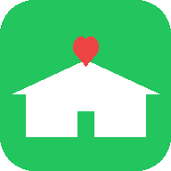

# Parents Weekly Briefing · Demo App

父母周报 Demo App

## 📸 Screenshots

  

> 📷 Android 真机截图待补充。以下是 3 个核心页面的功能说明：
>
> | 页面 | 功能 |
> |------|------|
> | 🏠 主页 | 四个大按钮入口 |
> | 📋 黄灯周报 | 子女端：状态灯 + 事实 + 建议 + 回声选项 |
> | 💊 用药确认 | 大按钮 + 子女回声卡片 |

**安装 APK 即可体验全部页面** → [Releases](https://github.com/aitogether/parents-weekly-briefing-demo-app/releases)

## 项目简介 / Project Overview

**中文：** 父母周报 Demo App 是一个独立的 Android 演示应用，用来展示"父母周报"的核心体验：子女每周黄灯周报、爸妈用药确认、大按钮 + 回声卡片。所有数据均为假数据，不联网。

**English:** Parents Weekly Briefing Demo App is a standalone Android APK that showcases the core experience of the main product: weekly briefing for adult children and gentle parent-side medication confirmation, using offline fake data only.

## 功能一览 / Features

- **Home**: Three big buttons to choose scenarios.
- **Child · Weekly Yellow Report**: Traffic light + 3 facts + 1 action + echo options.
- **Mom · Medication Confirm**: Big button + echo card.
- **Dad · Medication Confirm**: Big button, no echo card.

## 安装方式 / Installation

1. 从 [GitHub Releases](https://github.com/aitogether/parents-weekly-briefing-demo-app/releases) 下载 `parents-weekly-briefing-demo-v1.apk`。
2. 在 Android 8.0+ 设备上，进入 设置 → 安全 → 允许安装来自未知来源的应用。
3. 安装 APK。

> ⚠️ 本 App 仅用于演示，不联网、不收集任何真实数据。
> This app is for demo purposes only — it does not connect to the internet or collect any real data.

## 演示脚本 / Demo Walkthrough

1. **从主页点「子女端 · 本周黄灯周报」**，展示 绿/黄/红灯 + 3 事实 + 1 建议。
2. **回到主页 → 点「妈妈 · 用药确认」**，展示大按钮 + 子女回声。
3. **再点「爸爸 · 用药确认」**，展示只有按钮、无回声的状态。

## 和主项目的关系 / Related Project

- **主仓库 / Main repo**: [aitogether/parents-weekly-briefing](https://github.com/aitogether/parents-weekly-briefing)
- This demo app is a simplified offline companion to the main Parents Weekly Briefing project (backend + WeChat Mini Program).
- 本 demo 是主项目（后端 + 微信小程序）的离线简化演示版。
